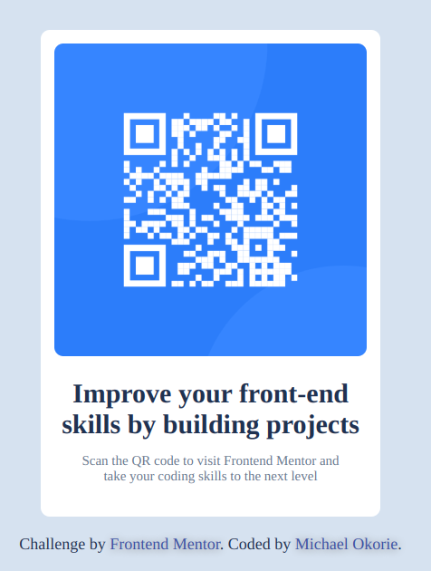

# qr-code-card - QR Code Component Solution

This is my solution to the [QR Code Component challenge on Frontend Mentor](https://www.frontendmentor.io/challenges/qr-code-component-iux_sIO_H). It's a clean and minimal UI component challenge that helped me sharpen my responsive layout and styling skills.  

Frontend Mentor challenges are a great way to improve coding skills by building real-world projects — and this one, though simple, was all about mastering precision and visual balance. 👨‍💻✨

---

## 📑 Table of contents

- [📸 Overview](#overview)
  - [Screenshot](#screenshot)
  - [Links](#links)
- [🧠 My process](#my-process)
  - [Built with](#built-with)
  - [What I learned](#what-i-learned)
  - [Continued development](#continued-development)
  - [Useful resources](#useful-resources)
- [🙋‍♂️ Author](#author)
- [🙏 Acknowledgments](#acknowledgments)

---

## 📸 Overview

### Screenshot



---

### 🔗 Links

- **Solution URL:** [https://github.com/Michael-Okorie/qr-code-card.git]
- **Live Site URL:** [https://michael-okorie.github.io/qr-code-card/]

---

## 🧠 My process

### 🛠️ Built with

- Semantic **HTML5** markup
- **CSS custom properties**
- **Flexbox** for layout
- **Mobile-first** responsive design
- Clean and minimalist design practices

---

### 💡 What I learned

Even a small component like a QR card has a lot to teach. This challenge helped me refine the following:

- How to **center elements** perfectly both vertically and horizontally using Flexbox:
  
```css
body{
    background-color: var(--Slate300);
    font-size: 15px;
    display: flex;
    justify-content: center;
    align-items: center;
    margin: 30px auto;
    position: relative;
    min-height: 100vh;
}

```

Improved understanding of using rem/em units for responsive padding and spacing

Creating a visually balanced card component

---

### 💡 What I learned

This project may look simple, but it taught me some powerful fundamentals:

- Improved understanding of using **`rem` / `em` units** for scalable, responsive spacing  
- Practiced crafting a **visually balanced card component** with proper use of whitespace and typography  
- Gained confidence in applying **mobile-first design principles** effectively

---

### 🔄 Continued development

In future projects, I want to:

- Integrate subtle **CSS animations** for smoother interactions (like hover states)  
- Explore **Sass** and **CSS Modules** to better organize and scale styles  
- Focus more on **accessibility**, especially keyboard navigation and visible focus indicators

---

### 📚 Useful resources

- 🔧 [CSS Tricks – Flexbox Guide](https://css-tricks.com/snippets/css/a-guide-to-flexbox/)  
  My go-to cheat sheet for mastering layout challenges.

- 🧠 [Frontend Mentor Discord](https://discord.gg/frontendmentor)  
  Amazing community for feedback, tips, and encouragement.

- ✍️ [The Markdown Guide](https://www.markdownguide.org/)  
  Helped me craft this beautiful and clean `README.md`.

---

## 🙋‍♂️ Author

- Github – [Michael Okorie](https://github.com/Michael-Okorie)  
- Frontend Mentor – [@Michael-Okorie](https://www.frontendmentor.io/profile/Michael-Okorie)  
- Twitter – [@Dev_Michael_](https://twitter.com/Dev_Michael_)

---

## 🙏 Acknowledgments

Massive thanks to the **Frontend Mentor** team for curating such great challenges.  
Special shout-out to the **community contributors** who share insightful solutions — they inspire and motivate me to improve with every project!

---

🌟 *If you liked this solution, feel free to leave a ⭐️, fork it, or reach out with any feedback! Let’s keep learning together.* 💪
